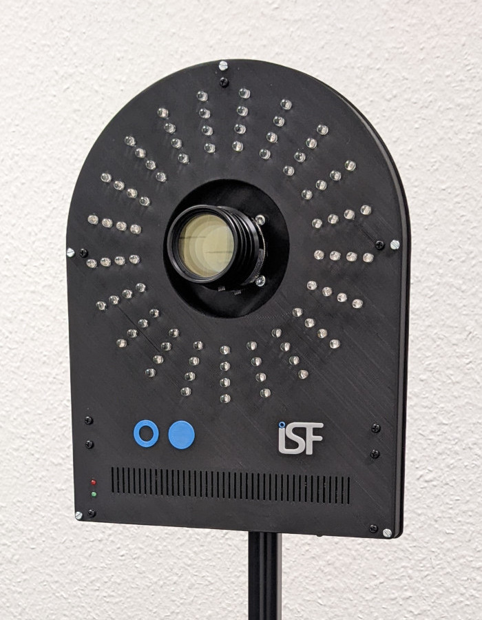
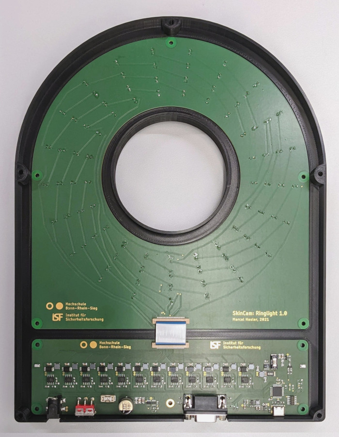
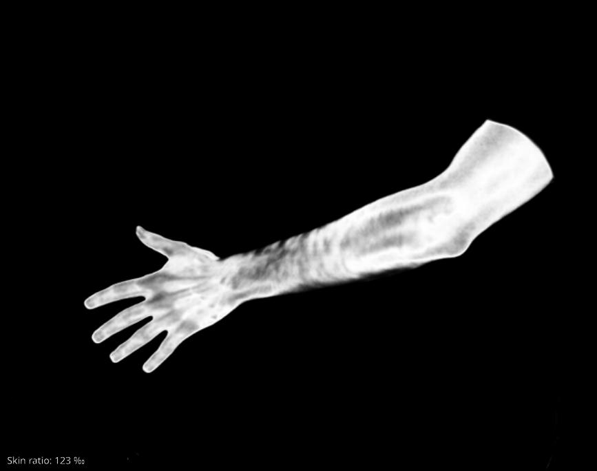
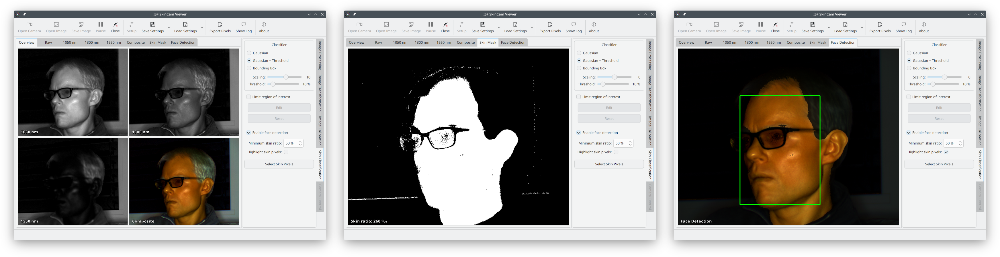

# ISF SkinCam

## Introduction

The objective of the SkinCam project was to implement a camera system for real-time skin detection and face verification using multispectral short-wavelength infrared (SWIR) imaging. It originated from previous research projects carried out at Bonn-Rhein-Sieg University of Applied Sciences, such as [FeGeb](https://www.h-brs.de/de/fegeb) and [Beyond SPAI](https://www.h-brs.de/en/beyond-spai).

  
  

Based on the original concepts and designs, a new and improved system was developed, offering higher frame rates and optimized SWIR lighting. It is currently being used in various successor projects in biometrics research, such as [BIOLAB](https://www.h-brs.de/en/isf/biolab).

  

## Concept

The system is based on a Goldeye G-033 SWIR camera by Allied Vision, combined with a multispectral ring light operating at wavelengths of 1050, 1300 and 1550 nm. By evaluating the absorption ratios at these specific wavelengths, it is possible to identify those pixels which have properties characteristic of human skin using a pre-trained classifier.

  

## Software

The software developed as part of this project is based on code originally written for the project Beyond SPAI, which itself was based on the FeGeb project but extended the original concept by using three SWIR cameras simultaneously, using relay optics to split the image.

A number of image processing filters were implemented to compensate for imperfections in the relay optics. While these aren't strictly necessary for a single-camera system, they were retained in the SkinCam software anyway.

The implementation uses OpenCL for real-time image processing and skin classification and employs a number of other optimizations in order to achieve a stable frame rate of 40 Hz even on mid- to low-end systems.

In addition to the OpenCL [development headers](https://github.com/KhronosGroup/OpenCL-CLHPP), [Qt6](https://www.qt.io/product/qt6), [FreeImage](https://freeimage.sourceforge.io/), [libIFD](https://github.com/ISF-H-BRS/FaceDetector), [libusb](https://libusb.info/), [libzip](https://libzip.org/) and the [Vimba SDK](https://www.alliedvision.com/en/products/vimba-sdk/) are required to build and run the software.

The firmware directory contains project files for both the newly developed system, which is based on a STM32 microcontroller, as well as for the original FeGeb system, which was based on an 8-bit AVR microcontroller.

A number of captured test images are provided within the repository that can be used to evaluate the software without having the actual camera system available. A setup file is also provided, containing suitable settings as well as necessary calibration and classification data.

## License

All source code for the software and firmware is licensed under the terms of the GNU General Public License (GPLv3). All schematics, layout and CAD files are licensed under the terms of the Creative Commons Attribution-ShareAlike International Public License (CC BY-SA). See COPYING in the respective subdirectories for details.

## Further Information

This document will be expanded over time to further detail some of the underlying concepts. For the time being, detailed information on the original project and concepts can be found in Holger Steiner's PhD thesis, available online [here](http://www.grk1564.uni-siegen.de/publicationPDFbyID?ID=825).
